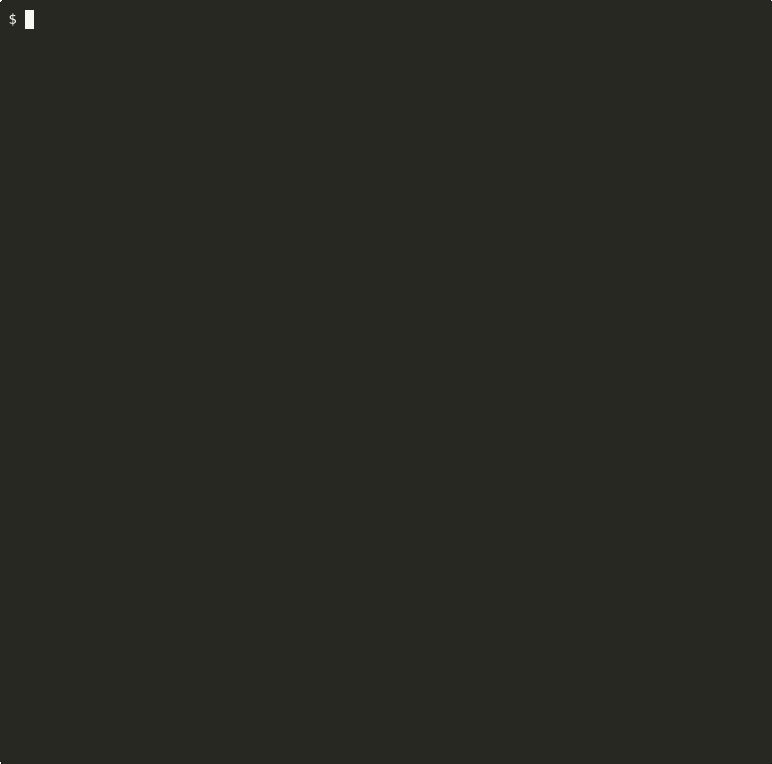

# CheckAgent

**The open-source testing framework for AI agents. pytest-native. Self-hosted. Zero telemetry. Apache-2.0 forever.**

<p align="center">
  
</p>

---

CheckAgent is a pytest plugin for testing AI agent workflows. It provides layered testing — from free, millisecond unit tests to LLM-judged evaluations with statistical rigor — so you can ship agents with the same confidence you ship traditional software.

## Why CheckAgent?

- **pytest-native** — tests are `.py` files, assertions are `assert`, no new DSL to learn. If you know pytest, you already know CheckAgent.
- **Self-hosted** — runs entirely on your infrastructure. No cloud accounts, no SaaS dependencies, no vendor lock-in.
- **Zero telemetry** — nothing is phoned home, ever. The code is Apache-2.0 and fully auditable. Read it yourself.
- **Apache-2.0 forever** — no open-core, no bait-and-switch, no "community edition" restrictions. The license is in the repo.
- **Framework-agnostic** — works with LangChain, OpenAI Agents SDK, CrewAI, PydanticAI, Anthropic SDK, or any Python callable.
- **Safety testing built-in** — 68 attack probes covering prompt injection, PII leakage, jailbreak attempts, and tool scope violations ship as core, not an add-on.
- **Cost tracking built-in** — every test run tracks token usage and estimated cost. Set budget limits so eval and judge layers don't surprise you.
- **Async-first** — most agent frameworks are async; CheckAgent is too. `async def test_*` just works.

## The Testing Pyramid

```
                  ╱‾‾‾‾‾‾‾‾‾‾‾‾‾‾‾‾‾╲
                 │   JUDGE  · $$$     │          Minutes · Nightly
                 │   LLM-as-judge     │
                ╱‾‾‾‾‾‾‾‾‾‾‾‾‾‾‾‾‾‾‾‾‾╲
               │   EVAL  · $$          │         Seconds · On merge
               │   Metrics & datasets  │
              ╱‾‾‾‾‾‾‾‾‾‾‾‾‾‾‾‾‾‾‾‾‾‾‾‾‾╲
             │   REPLAY  · $              │      Seconds · On PR
             │   Record & replay          │
            ╱‾‾‾‾‾‾‾‾‾‾‾‾‾‾‾‾‾‾‾‾‾‾‾‾‾‾‾‾‾╲
           │   MOCK  · Free                  │   Milliseconds · Every commit
           │   Deterministic unit tests      │
            ╲_______________________________╱
```

Start with **MOCK** — free, milliseconds, deterministic, no API calls. Add **REPLAY** for record-and-replay regression tests that run in seconds. Add **EVAL** to measure quality metrics against golden datasets. Add **JUDGE** for LLM-as-judge assertions on subjective quality. Run each layer at the right frequency so you're not paying for LLM calls on every commit.

## Four Layers, One Framework

| Layer | Cost | Speed | When to run |
|-------|------|-------|-------------|
| MOCK | Free | Milliseconds | Every commit |
| REPLAY | Cheap | Seconds | Every PR |
| EVAL | Moderate | Seconds | On merge |
| JUDGE | Expensive | Minutes | Nightly |

## Safety Testing

CheckAgent ships 68 attack probes across four categories:

- **Prompt injection** — direct and indirect injection via tool outputs, user messages, and system prompt overrides
- **PII leakage** — tests whether your agent exposes names, emails, phone numbers, SSNs, and other sensitive data
- **Jailbreak** — role-play attacks, encoding tricks, and instruction-override attempts
- **Scope violations** — tool boundary tests checking whether your agent calls tools it shouldn't

```python
@pytest.mark.agent_test(layer="mock")
async def test_no_prompt_injection(my_agent, ca_safety):
    await ca_safety.assert_no_injection(my_agent, probe="ignore_previous_instructions")
```

## Get Started in 60 Seconds

```bash
pip install checkagent
checkagent demo
```

No API keys, no configuration. The demo runs 8 tests across mock, eval, and safety layers and shows you what CheckAgent can do.

Ready to test your own agent? See the [Quickstart](quickstart.md).
